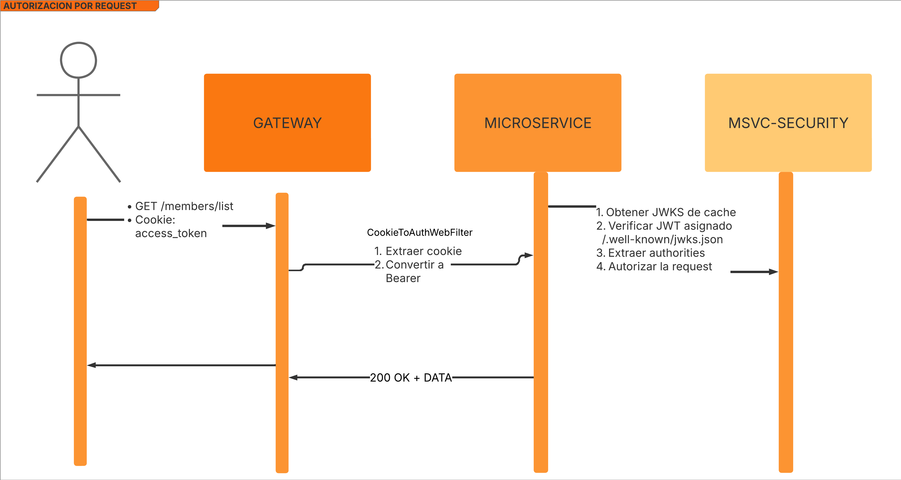

# FitDesk

---

## Tabla de Contenidos

1. [Introducción](#1-introducción)
2. [Características](#2-características)
3. [Arquitectura del Sistema](#3-arquitectura-del-sistema)
4. [Tecnologías Utilizadas](#4-tecnologías-utilizadas)
5. [Microservicios](#5-microservicios)
6. [Frontend](#6-frontend)
7. [Instalación y Configuración](#7-instalación-y-configuración)
8. [Integración Continua (CI/CD)](#8-integración-continua-cicd)
9. [Contribución](#9-contribución)

---

## 1. Introducción

Sistema de Gimnacio FitDesk

---

## 2. Características

- **Modularidad:** Cada dominio del negocio se implementa como un microservicio independiente.
- **Escalabilidad:** Diseñado para crecer y adaptarse a nuevos requerimientos.
- **Seguridad:** Implementación de seguridad con Spring Security , JWT  y   JWK Set URI en Cookies.
- **Interfaz Intuitiva:** Frontend moderno y responsive desarrollado en React 19.
- **Documentación Completa:** APIs documentadas con Swagger/OpenAPI.
- **Integración Continua:** Automatización del proceso de construcción y despliegue a través de GitHub Actions.

---

## 3. Arquitectura del Sistema

La solución se basa en una arquitectura de microservicios, la cual permite:

- **Desarrollo y despliegue independiente:** Cada servicio puede ser actualizado sin afectar a los demás.
- **Comunicación mediante REST APIs:** Los microservicios se comunican de forma segura y eficiente.
- **Descubrimiento de Servicios:** Utilización de Eureka Netflix para la gestión dinámica de servicios.
- **Resiliencia:** Implementación de patrones de resiliencia con Resilience4j.
- **Mensajería Asincrona:** Comunicación entre microservicios mediante Kafka.
- **Circuit Breaker:** Protección contra fallos en cascada entre microservicios.
- **Balanceo y Gateway:** Un API Gateway centraliza las solicitudes y distribuye la carga.
- **Base de Datos Autónoma:** Cada microservicio utiliza su propia base de datos PostgreSQL.

> **Diagrama de Arquitectura:**  
> 

**Diagrama de Seguridad:**  
> ***Diagrama de Login***
> 
> ***Diagrama de Register***
> 
> ***Diagrama de Request***
> 
---

## 4. Tecnologías Utilizadas

### Backend

- **Java** con Spring Boot, Spring Data y Spring Security.
- **PostgreSQL:** Bases de datos separadas para cada microservicio.
- **Lombok:** Para reducir código repetitivo.
- **Resilience4j:** Manejo de resiliencia en las llamadas a servicios.

### Frontend

- **React 19:** Desarrollo de la interfaz de usuario.
- **Tailwind:** Biblioteca de estilos.
- **Shadcn:** Biblioteca de componentes.

### Infraestructura

- **Spring Cloud Gateway:** Para balanceo de cargas y gestión del tráfico.
- **Docker:** Contenerización y despliegue simplificado.

---

## 5. Microservicios

Cada microservicio se encarga de un dominio específico:

#### Eureka Netflix

- **Funcionalidad:**
  - Gestión centralizada de usuarios y servicios.
  - Descubrimiento de servicios: Permite que otros microservicios se registren y se descubran dinámicamente.
- **Uso:**
  - Proporciona endpoints para registrar y monitorizar la disponibilidad de los microservicios.
  - Facilita la escalabilidad al permitir que nuevos servicios se integren sin necesidad de reconfiguración manual.

#### Microservice-Members

- **Funcionalidad:**
  - Administración y gestión de clientes.
  - Permite operaciones CRUD (Crear, Leer, Actualizar y Eliminar) para la información de clientes.
- **Uso:**
  - Asegura la integridad y consistencia de los datos de clientes a través de una base de datos dedicada.
  - Facilita la integración con otros microservicios que necesiten acceder a la información de clientes.

#### Microservice-Security

- **Funcionalidad:**
  - Gestión de autenticaciones y autorizaciones para asegurar el acceso a todos los microservicios.
  - Implementa mecanismos de seguridad basados en JWT para controlar y validar el acceso a los endpoints.
- **Uso:**
  - Centraliza la verificación de credenciales y la emisión de tokens de acceso.
  - Se encarga de proteger los recursos sensibles del sistema.
- **Documentación:**

---

## 6. Frontend

La aplicación React 19 centraliza las funcionalidades de todos los microservicios, ofreciendo:

- **Dashboard:** Visualización de estadísticas y métricas en tiempo real.
- **Gestión Integral:** Administración de usuarios, clientes, productos y ventas.
- **Interfaz Moderna:** Diseño responsive y experiencia de usuario optimizada.

---

## 7. Instalación y Configuración

### Prerrequisitos

- **Java 21+**
- **Node.js 20+**
- **React 19**
- **Docker**

### Pasos para el Backend

1. **Clonar Repositorios:**

   ```bash
   https://github.com/FitDesk/config-server.git
   https://github.com/FitDesk/msvc-chat.git
   https://github.com/FitDesk/msvc-notifications.git
   https://github.com/FitDesk/msvc-classes.git
   https://github.com/FitDesk/msvc-members.git
   https://github.com/FitDesk/msvc-billing.git
   https://github.com/FitDesk/gateway.git
   https://github.com/FitDesk/msvc-security.git
   https://github.com/FitDesk/eureka-server.git
   ```

2. **Configurar Bases de Datos y Variables de Entorno:**
   Revisa y ajusta los archivos de configuración o utiliza un archivo de ejemplo como `.env.example`.

3. **Ejecutar los Microservicios:**

   ```bash
   ./mvnw spring-boot:run
   ```

### Pasos para el Frontend

1. **Clonar el Repositorio:**

   ```bash
   https://github.com/FitDesk/front-end.git
   ```

2. **Instalar Dependencias:**

   ```bash
   bun install
   ```

3. **Ejecutar la Aplicación:**

   ```bash
   bun run dev
   ```

---

## 8. Integración Continua (CI/CD)

Para automatizar la construcción y despliegue del proyecto, se ha implementado un pipeline de GitHub Actions. Este pipeline realiza las siguientes tareas:

- **Verificación en Pull Requests:**

  - Checkout del repositorio, configuración de JDK 21 y compilación con Maven.
  - Verificación de la generación del JAR y construcción de la imagen Docker.

- **Construcción y Despliegue en Push:**
  - Construcción y validación del proyecto.
  - Login en Docker Hub, construcción y push de la imagen Docker.
  - Despliegue automático en Azure mediante Docker y Azure Container Service for WebApp.

> 

---

## 9. Contribución

¡Las contribuciones son bienvenidas! Si deseas colaborar:

1. Clona el repositorio y crea una rama con un nombre descriptivo.
2. Realiza tus cambios siguiendo las buenas prácticas de codificación.
3. Envía un Pull Request detallando las mejoras o correcciones implementadas.
4. **Código de Conducta:** Por favor, respeta el Código de Conducta del proyecto.

---
